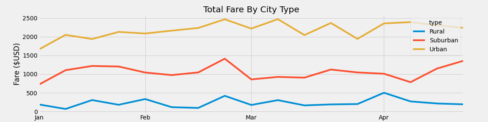

# PyBer_Analysis
#【PyBer_Challenge】(PyBer_Challenge.ipynb)

# Overview of the Analysis:
## The purpose of the project was to design and analyze data for PyBer Company to calculate metrics about the total weekly fares for each city type (Urban, Suburban, Rural). In this project, there are different variables such as total rides, total drivers, total fares, average fare per ride and driver for each of the respective city types. Then I created new data frame that includes the average fare per week from 2019.01.01 to 2019.04.29. Finanlly, I create a plot which shows the average fare price of three different type.

# Results:
## Summary DataFrame 
![PyBer_Summary] (analysis/PyBer_Summary.png)

### From this summary, we could see that there are the most amount of rides and drivers in urban area, and there are least in rural area. In the Total Fares, we could find urban area brings the most revenue, and rural areas brings least. However, for the Average Fare per Ride and Average Fare per Driver, the data in rural area are higher than urban.

## Multiple-Line Chart

### From this line chart, we analyzed for the total fare for each of the ciy types in this time period. It shows Urban area had the highest total fares for all the weeks and rural areas had the least. and the 3rd week of February has the highest total fares for each of the city type showing increased demand at that time. 

# Summary: 
- As PyBer_Summary shows, totol drivers in urban area were 2405, however, total rides only had 1625, which means there are around 800 differences. The company should do more on marketing campaign to attract more customers to balance between drivers and rides, since that is the largest part of revenue.

- Same with previous recommendation, as PyBer_Summary shows, total drivers in rural area were 78, total rides had 125, which means there are around 50% differences. The company should hire more drivers in the rural area and do the campaign to attract more customers, since average fare per Ride and average fare per driver are the highest in three city type. If company could do the campaign to get more customers, it would be easier to get drivers.

- The company should anlyze the trends of demands, then balance drivers and rides. As line chart shows, the 3rd week of February has the highest total fares for each of the city type. Company could do the analyze to find whether that is coincidence or not. If not, company could arrange more drivers in next year.